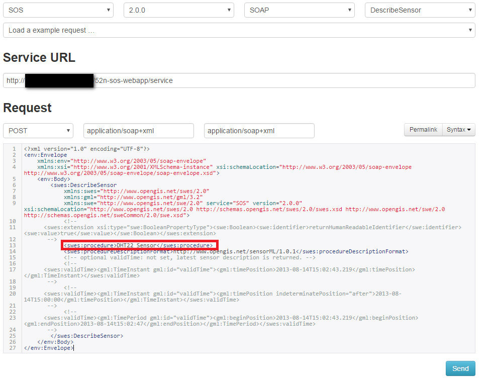
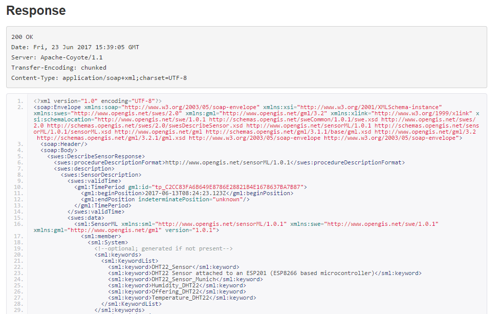

# DescribeSensor
By providing the correct parameters in the client, the desciption of the sensor can be retrieved using the `DescribeSensor` operation.

The DescribeSensor request can be submitted using the SOS Client by setting the right paramaters as shown in the example below:

As shown in the screenshot above, please select the DescribeSensor operation in the SOS client. 
It will form the sample request. 
In the parameters, please provide the correct *procedure name* of your sensor (as highlighted). 
In the procedureDescriptionFormat, the definition of SensorML format is defined. 
Upon sending the request, the client will show the response message as shown below:

The response is the SensorML instance document showing the metadata of the sensor.
The same request can also be made using KVP encoding (by simply providing the parammeters in the form of URL). 
The request can directly be sent with the help of a web browser and will return the response on the browser. 
For example, the `DescribeSensor` request for our example sensor would be:

The different parameters of this request are:
* Service URL: http://mysos.de:8080/52n-sos-webapp/service
  * REQUEST=DescribeSensor
  * SERVICE=SOS&VERSION=2.0.0
  * PROCEDURE=DHT22_Sensor
  * procedureDescriptionFormat=http://www.opengis.net/sensorML/1.0.1
* Full request URL:

  http://mysos.de:8080/52n-sos-webapp/service?REQUEST=DescribeSensor&SERVICE=SOS&VERSION=2.0.0&PROCEDURE=DHT22_Sensor&procedureDescriptionFormat=http://www.opengis.net/sensorML/1.0.1
