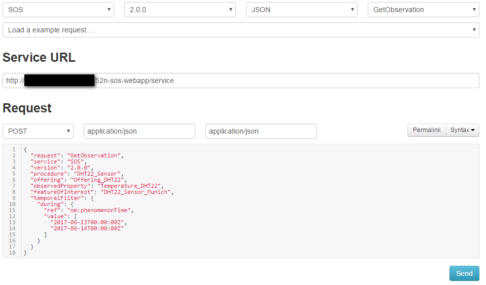
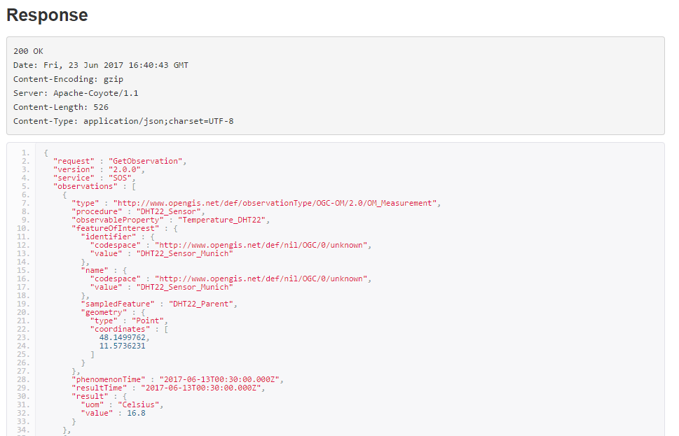

# GetObservation
By providing the correct parameters in the client, observations can be retrieved using the `GetObservation` operation.

The GetObservation request can be submitted using the SOS Client by setting the right paramaters as shown in the example below:

As shown in the screenshot above, please select the `GetObservation` operation in the SOS client. 
It will provide different options for filters and form the sample request. 
Please provide the correct parameters in the request based on your sensor details. 
Upon sending the request, the client will show the response message:

The response is encoded according to the O&M format.

The request can also be made using KVP encoding (by simply providing the parammeters in the form of URL). 
The request can directly be sent with the help of a web browser and will return the response on the browser. 
For example, the `GetObservation` request for the property *Temperature_DHT22* within a given time span would be:

The different parameters of this request are:
* Service URL: http://mysos.de:8080/52n-sos-webapp/service
  * REQUEST=GetObservation
  * SERVICE=SOS&VERSION=2.0.0
  * PROCEDURE=DHT22_Sensor
  * featureOfInterest=DHT22_Sensor_Munich
  * observedProperty=Temperature_DHT22
  * temporalFilter=om:phenomenonTime,2017-06-13T00:00:00Z/2017-06-14T00:00:00Z
* Full request URL:

  http://mysos.de:8080/52n-sos-webapp/service?service=SOS&version=2.0.0&request=GetObservation&featureOfInterest=DHT22_Sensor_Munich&procedure=DHT22_Sensor&observedProperty=Temperature_DHT22&temporalFilter=om:phenomenonTime,2017-06-13T00:00:00Z/2017-06-14T00:00:00Z
