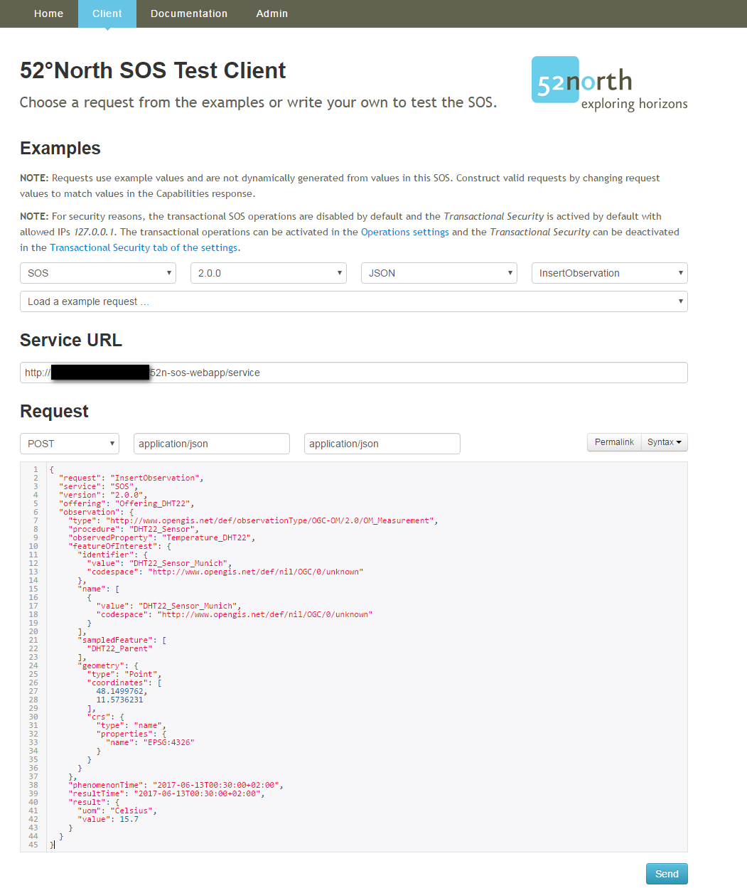
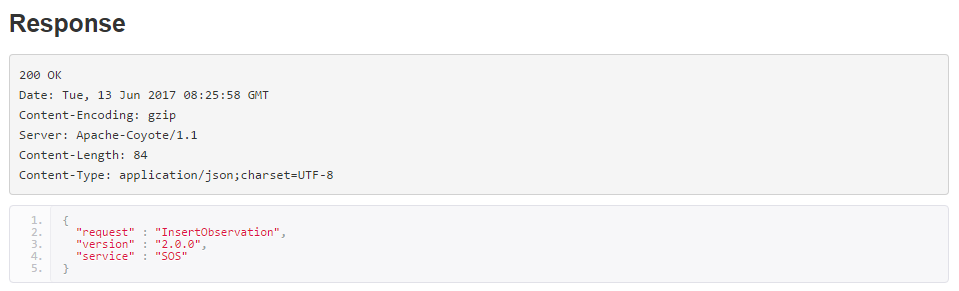

# InsertObservation
The individual observations of a sensor can be inserted using the `InsertObservation` operation. 
The parametres can be provided for this operation using the SOS client. 
The binding can be used either JSON or SOAP. 
An example JSON based request to insert observations is listed below:

`ObservedProperty: Temperature_DHT22`
```json
{
  "request": "InsertObservation",
  "service": "SOS",
  "version": "2.0.0",
  "offering": "Offering_DHT22",
  "observation": {    
    "type": "http://www.opengis.net/def/observationType/OGC-OM/2.0/OM_Measurement",
    "procedure": "DHT22_Sensor",
    "observedProperty": "Temperature_DHT22",
    "featureOfInterest": {
      "identifier": {
        "value": "DHT22_Sensor_Munich",
        "codespace": "http://www.opengis.net/def/nil/OGC/0/unknown"
      },
      "name": [
        {
          "value": "DHT22_Sensor_Munich",
          "codespace": "http://www.opengis.net/def/nil/OGC/0/unknown"
        }
      ],
      "sampledFeature": [
        "DHT22_Parent"
      ],
      "geometry": {
        "type": "Point",
        "coordinates": [
          48.1499762,
          11.5736231
        ],
        "crs": {
          "type": "name",
          "properties": {
            "name": "EPSG:4326"
          }
        }
      }
    },
    "phenomenonTime": "2017-06-13T00:30:00+02:00",
    "resultTime": "2017-06-13T00:30:00+02:00",
    "result": {
      "uom": "Celsius",
      "value": 15.7
    }
  }
}
```

`ObservedProperty: Humidity_DHT22`
```json
{
  "request": "InsertObservation",
  "service": "SOS",
  "version": "2.0.0",
  "offering": "Offering_DHT22",
  "observation": {    
    "type": "http://www.opengis.net/def/observationType/OGC-OM/2.0/OM_Measurement",
    "procedure": "DHT22_Sensor",
    "observedProperty": "Humidity_DHT22",
    "featureOfInterest": {
      "identifier": {
        "value": "DHT22_Sensor_Munich",
        "codespace": "http://www.opengis.net/def/nil/OGC/0/unknown"
      },
      "name": [
        {
          "value": "DHT22_Sensor_Munich",
          "codespace": "http://www.opengis.net/def/nil/OGC/0/unknown"
        }
      ],
      "sampledFeature": [
        "DHT22_Parent"
      ],
      "geometry": {
        "type": "Point",
        "coordinates": [
          48.1499762,
          11.5736231
        ],
        "crs": {
          "type": "name",
          "properties": {
            "name": "EPSG:4326"
          }
        }
      }
    },
    "phenomenonTime": "2017-06-13T00:30:00+02:00",
    "resultTime": "2017-06-13T00:30:00+02:00",
    "result": {
      "uom": "Percent",
      "value": 37.7
    }
  }
}
```
The `InsertObservation` request can be submitted using the SOS Client by setting the right paramaters as mentioned below:



Upon successful insertion of the sensor observtion, the client will show the response message shown as below:



All the operations using JSON bindings can be submitted using the same parameters. 
However, this operation allows inserting only one observation per request. 
Hence, it is required to create the requests for each observations, which can be cumbersome. 
In order to make this process simpler, 52° North solution provides `InsertResult` operation.
