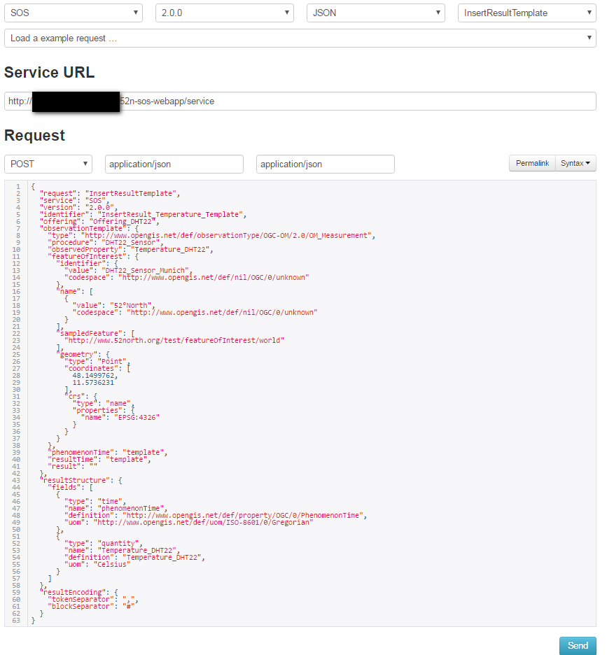
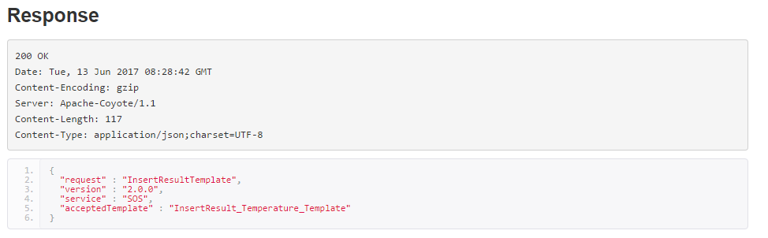
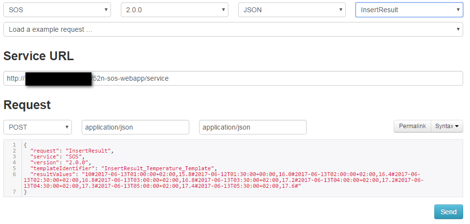
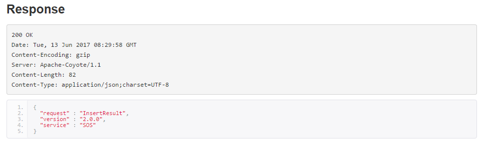

# InsertResult
In order to insert results, it is first required to define the template of the result. 
This template describes the structure of the values of `InsertResult` operation.
Once the template is defined, the raw values can simply be inserted without having the need to provide all the parameters for each request again.

The template of inserting the results of different properties can be defined as follows:

## InsertResultTemplate
`ObservedProperty: Temperature_DHT22`

```json
{
  "request": "InsertResultTemplate",
  "service": "SOS",
  "version": "2.0.0",
  "identifier": "InsertResult_Temperature_Template",
  "offering": "Offering_DHT22",
  "observationTemplate": {
    "type": "http://www.opengis.net/def/observationType/OGC-OM/2.0/OM_Measurement",
    "procedure": "DHT22_Sensor",
    "observedProperty": "Temperature_DHT22",
    "featureOfInterest": {
      "identifier": {
        "value": "DHT22_Sensor_Munich",
        "codespace": "http://www.opengis.net/def/nil/OGC/0/unknown"
      },
      "name": [
        {
          "value": "52°North",
          "codespace": "http://www.opengis.net/def/nil/OGC/0/unknown"
        }
      ],
      "sampledFeature": [
        "http://www.52north.org/test/featureOfInterest/world"
      ],
      "geometry": {
        "type": "Point",
        "coordinates": [
          48.1499762,
          11.5736231
        ],
        "crs": {
          "type": "name",
          "properties": {
            "name": "EPSG:4326"
          }
        }
      }
    },
    "phenomenonTime": "template",
    "resultTime": "template",
    "result": ""
  },
  "resultStructure": {
    "fields": [
      {
        "type": "time",
        "name": "phenomenonTime",
        "definition": "http://www.opengis.net/def/property/OGC/0/PhenomenonTime",
        "uom": "http://www.opengis.net/def/uom/ISO-8601/0/Gregorian"
      },
      {
        "type": "quantity",
        "name": "Temperature_DHT22",
        "definition": "Temperature_DHT22",
        "uom": "Celsius"
      }
    ]
  },
  "resultEncoding": {
    "tokenSeparator": ",",
    "blockSeparator": "#"
  }
}
```

`ObservedProperty: Humidity_DHT22`

```json
{
  "request": "InsertResultTemplate",
  "service": "SOS",
  "version": "2.0.0",
  "identifier": "InsertResult_Humidity_Template",
  "offering": "Offering_DHT22",
  "observationTemplate": {
    "type": "http://www.opengis.net/def/observationType/OGC-OM/2.0/OM_Measurement",
    "procedure": "DHT22_Sensor",
    "observedProperty": "Humidity_DHT22",
    "featureOfInterest": {
      "identifier": {
        "value": "DHT22_Sensor_Munich",
        "codespace": "http://www.opengis.net/def/nil/OGC/0/unknown"
      },
      "name": [
        {
          "value": "52°North",
          "codespace": "http://www.opengis.net/def/nil/OGC/0/unknown"
        }
      ],
      "sampledFeature": [
        "http://www.52north.org/test/featureOfInterest/world"
      ],
      "geometry": {
        "type": "Point",
        "coordinates": [
          48.1499762,
          11.5736231
        ],
        "crs": {
          "type": "name",
          "properties": {
            "name": "EPSG:4326"
          }
        }
      }
    },
    "phenomenonTime": "template",
    "resultTime": "template",
    "result": ""
  },
  "resultStructure": {
    "fields": [
      {
        "type": "time",
        "name": "phenomenonTime",
        "definition": "http://www.opengis.net/def/property/OGC/0/PhenomenonTime",
        "uom": "http://www.opengis.net/def/uom/ISO-8601/0/Gregorian"
      },
      {
        "type": "quantity",
        "name": "Humidity_DHT22",
        "definition": "Humidity_DHT22",
        "uom": "Percent"
      }
    ]
  },
  "resultEncoding": {
    "tokenSeparator": ",",
    "blockSeparator": "#"
  }
}
```

The `InsertResultTemplate` request can be submitted using the SOS Client by setting the right paramaters as shown below:



Upon successful insertion of the template, the client will show the response message:



### InsertResult
After successfully inserting the template, the observations can be inserted as follows:

`ObservedProperty: Temperature_DHT22`

```json
{
  "request": "InsertResult",
  "service": "SOS",
  "version": "2.0.0",
  "templateIdentifier": "InsertResult_Temperature_Template",
  "resultValues": "10#2017-06-13T01:00:00+02:00,15.8#2017-06-12T01:30:00+00:00,16.0#2017-06-13T02:00:00+02:00,16.4#2017-06-13T02:30:00+02:00,16.8#2017-06-13T03:00:00+02:00,16.8#2017-06-13T03:30:00+02:00,17.2#2017-06-13T04:00:00+02:00,17.2#2017-06-13T04:30:00+02:00,17.3#2017-06-13T05:00:00+02:00,17.4#2017-06-13T05:30:00+02:00,17.6#"
}
```

`ObservedProperty: Humidity_DHT22`
```json
{
  "request": "InsertResult",
  "service": "SOS",
  "version": "2.0.0",
  "templateIdentifier": "InsertResult_Humidity_Template",
  "resultValues": "10#2017-06-13T01:00:00+02:00,35.8#2017-06-12T01:30:00+00:00,36.0#2017-06-13T02:00:00+02:00,36.4#2017-06-13T02:30:00+02:00,36.8#2017-06-13T03:00:00+02:00,36.8#2017-06-13T03:30:00+02:00,37.2#2017-06-13T04:00:00+02:00,37.2#2017-06-13T04:30:00+02:00,37.3#2017-06-13T05:00:00+02:00,37.4#2017-06-13T05:30:00+02:00,37.6#"
}
```

Afterwards, the `InsertResult` request can be submitted as shown below:



Upon successful insertion of the results, the client will show the response message:


