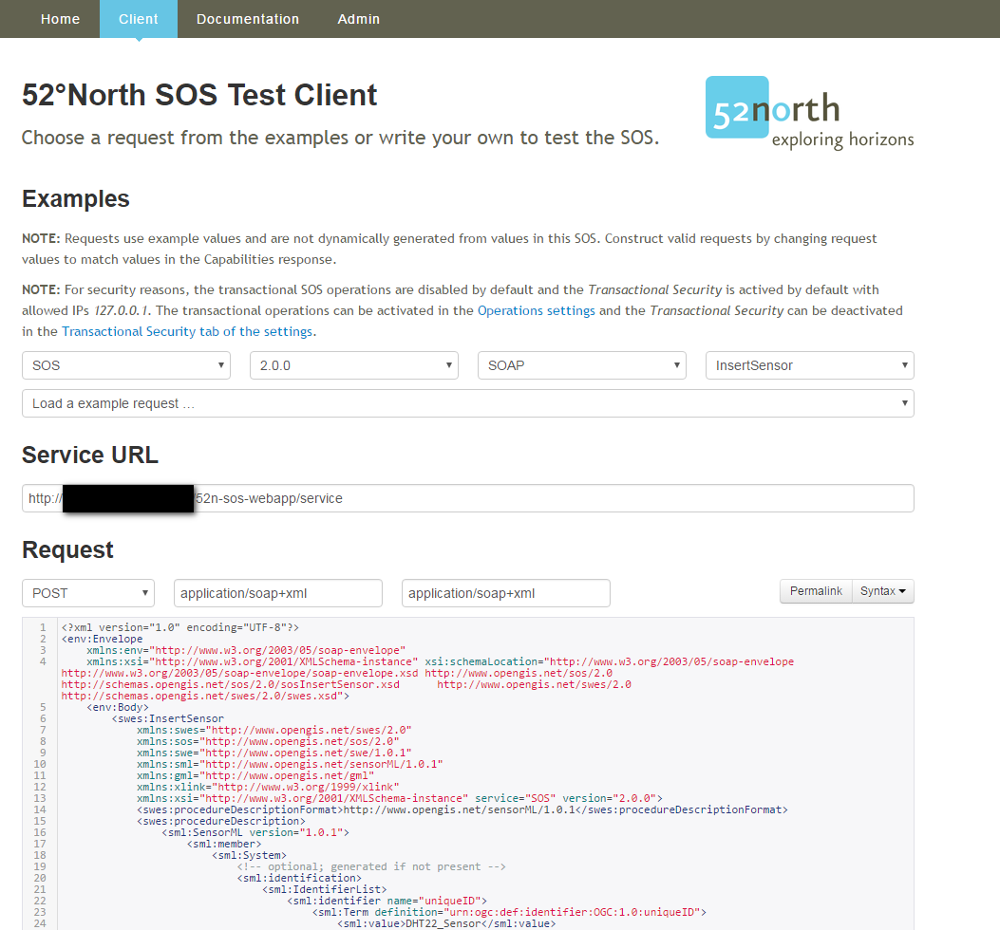
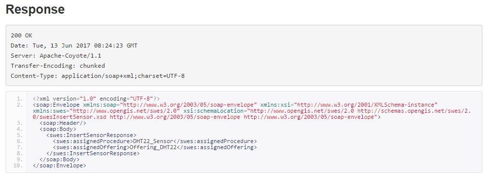

# Inserting a new sensor
Before inserting new observations, it is necessary to add the new sensor to your SOS instance first. A new sensor can be registered using the `InsertSensor` operation. 
It allows defining the sensor properties and metadata such as *sensor location*, *procedures*, *offerings*, *observation properties* (e.g. temperature, humidity) and *unit of measurement* for each property.

[`InsertSensor-SOAP.xml`](insertSensor-SOAP.xml) contains an example request.

The InsertSensor request can be submitted using the SOS Client by setting the right paramaters as shown in the example.

Upon successful insertion of the sensor, the client will show a response message like the one below:

