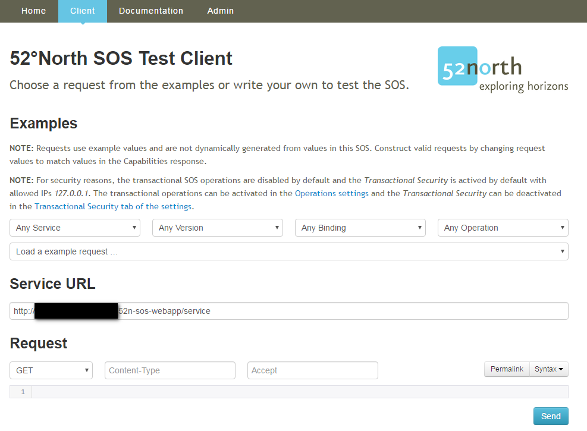

# Geo Sensor Web - SOS example requests
Today, there are hundreds of millions of Internet-connected sensors on, in and around the Earth, and the number is growing rapidly.
At the [Chair of Geoinformatics](http://www.gis.bgu.tum.de/), [Technical University of Munich (TUM)](https://www.tum.de/) 
the modeling and handling of sensor data has been a topic of research and education in the past year.
Most of the work we do in that field is based on the OGC's [Sensor Web Enablement (SWE)](http://www.opengeospatial.org/ogc/markets-technologies/swe) standards suite.
A popular open source implementation of the SWE standards is the [Sensor Observation Service (SOS)](http://52north.org/communities/sensorweb/sos/index.html) 
developed by the [52°North Initiative for Geospatial Open Source Software GmbH](www.52north.org).

This repository contains example requests for the 52°North SOS for *registering new sensors* to the service and *adding observations* for them.
Moreover, some general information on how to use these requests with the *52°North SOS client* and how to send them from the command line is provided. 
The repository has been created for educational purpose but may be helpful for anybody involved with the 52°North SOS implementation.
Each request is stored and documented in a separate folder. Navigate to the folder of the request you are looking for to find the documentation and examples.

If you encounter a mistake or have a suggestion what we could add or improve, please let us know and post an [issue](https://github.com/tum-gis/sos-examples/issues).

## Content
* [SOS Client usage example](#sos-client-usage)
* [Sending SOS request from the Shell](#sos-shell)
* [SOS example requests](#sos-example-requests)
  * [GetCapabilities and Key Value Pair(KVP) requests](#sos-example-requests-get-capabilities)
  * [InsertSensor](#sos-example-requests-insert-sensor)
  * [DescribeSensor](#sos-example-requests-describe-sensor)
  * [InsertObservation](#sos-example-requests-insert-observation)
  * [GetObservation](#sos-example-requests-get-observation)
  * [GetCapabilities](#sos-example-requests-get-capabilities)        

## SOS client usage example
In order to receive/send data from/to an SOS instance so called requests are used. The 52°North SOS come with a SOS client, that makes it easy to edit and send requests.
Please find a simple example on how to work with the client below.

The SOS client can be accessed using the following link: http://mysos.de:8080/52n-sos-webapp/client

This client can be used to send requests and perform the SOS operations. As shown in the image below, the parameters for the SOS operations can very easily be provided in the requests.
Upon selecting the appropriate parameters, the client provides the example requests which can be used to learn for making our own requests.
Once the request with correct parameter and syntax is created, it can be sent to the service by clicking on the *Send* button.
The response message can be visualized in the client accordingly. In case of errors, the client will show the error message.

Simply use the dropdown menus to select a *service*, *version*, *binding* and *operation*. After that, use the *Load example request* dropdown, to select the example request you want to load.
It is recommended to copy the example request shown now in the client to a text editor (e.g. [Notepad++](https://notepad-plus-plus.org/)) and work on the request offline. 
Whenever you want to test your request copy it back to the client window and press the *Send* button to transmit it.

**Note: It is not possible to send transactional requests with a transactional authorization token using this client, as it is not possible to edit the HTTP header of the request. 
Please take a look at the [curl folder](curl) if you want to use transactional operations!**

## Sending SOS requests from the Shell
Besides using the built in client of the 52°North SOS, as described above, SOS requests can be send from a [Unix shell](https://en.wikipedia.org/wiki/Unix_shell) as well.
If you want to automize request for e.g. sheduled uploading of SOS requests to a SOS server, this is the way to go. 
Please find some examples on how to do that with the [CURL](https://en.wikipedia.org/wiki/CURL) utility in the [curl folder](curl).

## SOS example requests
Before beginning to perform SOS operations, please learn about all the SOS requests in the [SOS operations overview](sos-operations-overview). 
Once you are familiar with the SOS operations and the supported bindings, you are ready to create your own requests.

In order to register your sensor and the sensor observations in the SOS, please adapt the following example requests to your own needs.
If you are missing any information for a request, run a `GetCapabilities` request and search the answer for the specific operation you want to perform.

###  GetCapabilities and Key Value Pair(KVP) requests
This operation allows clients to retrieve *service metadata* from a service instance.
For instance, `GetCapabilities` can be used to query for a list of sensors associated with the SOS or all allowed operations. 
It also helps in forming the right encodings and parameters for specific operations.

The GetCapabilities request can be made using the SOS client by simply selecting the right parameters. 
However, it is also possible to make this request using Key Value Pair(KVP) encoding, where all request content is encoded in the URL.

All request parameters are appended to the *SOS service URL* as KVPs. The first KVP is separated from the service URL with a `?`.
All further KVPs are appended with a `&`, as shown in the examples below:

* SOS Service URL: http://mysos.de:8080/52n-sos-webapp/service
* KVPs
  * request=GetCapabilities
  * service=SOS
  * version=2.0.0
* Resulting request URL: 

  http://mysos.de:8080/52n-sos-webapp/service?request=GetCapabilities&service=SOS&version=2.0.0

The basic request with no additional parameters but *service* and *version* lists the complete capabilities of the SOS. 
However, it is possible to retrieve only specific sections by providing additional parameters, as listed in the table below:

Request content  | KVPs
-----------------|---------
Details on the service provider | request=GetCapabilities&service=SOS&Sections=ServiceProvider
List of possible operations supported by the service and their metadata, showing which encodings are supported by each operation | request=GetCapabilities&service=SOS&version=2.0.0&Sections=OperationsMetadata
Filter Capabilities | request=GetCapabilities&service=SOS&version=2.0.0&Sections=FilterCapabilities
Entire content of the SOS | request=GetCapabilities&service=SOS&version=2.0.0&Sections=Contents

### InsertSensor
Before inserting new observations, it is necessary to add the new sensor to your SOS instance first. 
A new sensor can be registered using the `InsertSensor` operation. 
It allows defining the sensor properties and metadata such as *sensor location*, *procedures*, *offerings*, *observation properties* (e.g. temperature, humidity) and *unit of measurement* for each property.

Please find an `InsertSensor` SOAP example request and further documentation in the [InsertSensor folder](InsertSensor).

### DescribeSensor
Once the sensors are registered, the sensor metadata can be retrieved using the `DescribeSensor` operation. 
This operation is used for requesting information about sensor such as *sensor location*, *procedures*, *offerings*, *observation properties* (e.g. temperature, humidity) and *unit of measurement* for each property.
The response of this operation is encoded in a [OGC Sensor Model Language (SensorML)](http://www.opengeospatial.org/standards/sensorml) instance document.

Please find further documentation in the [DescribeSensor folder](DescribeSensor).

### InsertObservation
Once the sensor is registered to the SOS, its observations can be inserted. 
The observation offering can be specified for the sensor, to which the observations can be uploaded in the running SOS. 
There are two ways to insert the observations:

#### (a) Using InsertObservation
The `InsertObservation` operation allows the client to insert new observations for a sensor system. 
The request includes the *details of the sensor*, the *observed property*, the *time of the observation*, and its respective *property*.

Please find further documentation in the [InsertObservation folder](InsertObservation).

#### (b) Using InsertResultTemplate and InsertResult
The `InsertObservation` operation allows inserting only one observation per request. 
Hence, it is required to create a single requests for each observations, which can be cumbersome. 
In order to make this process simpler, the 52° North SOS provides the `InsertResultTemplate` and `InsertResult` operations, 
using which, multiple observations can be inserted without having the need to provide all parameters everytime.

Please find further documentation in the [InsertResult folder](InsertResult).

### GetObservation
The `GetObservation` operation is designed to query the service for observation data structured according to the [Observation and Measurement (O&M)](http://www.opengeospatial.org/standards/om) specification. 
The request can be made by setting up parameters such as specific *procedure*, *offering*, and *observedProperty*. 
In addition, it is also possible to query the observations based on filters such as:
 * *temporalFilter*: A filter for a time property of the requested observations
 * *spatialFilter*: A filter which applies to a spatial property of an observation

Please find further documentation in the [GetObservation folder](GetObservation).
