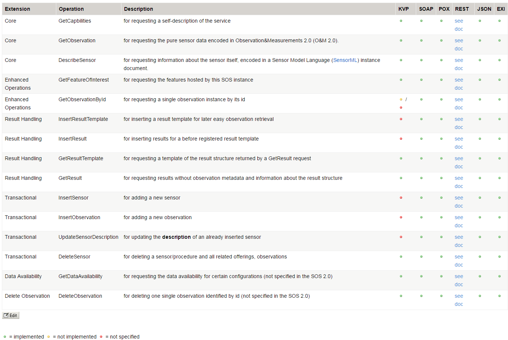

# Sensor Observation Service Specification v2.0

The OGC SOS 2.0 specification was adopted in 2012 and besides the core operations three extension are defined within the specification: Enhanced, Transactional, and Result Handling.
### Core
* `GetCapabilities`, for requesting a self-description of the service .
* `GetObservation`, for requesting the pure sensor data encoded in Observation&Measurements (O&M).
* `DescribeSensor`, for requesting information about the sensor itself, encoded in a Sensor Model Language (SensorML) instance document.

### Enhanced Extension
* `GetFeatureOfInterest`, for requesting the GML 3.2.1 encoded representation of the feature that is the target of the observation.
* `GetObservationById`, for requesting the pure sensor data for a specific observation identifier.

### Transactional Extension
* `InsertSensor`, for publishing new sensors.
* `UpdateSensorDescription`, for updating the description of a sensor.
* `DeleteSensor`, for deleting a sensor.
* `UpdateSensorDescription`, for publishing observations for registered sensors.

### Result Handling Extension
* `InsertResultTemplate`, for inserting a result template into a SOS server that describes the structure of the values of a `InsertResult` or `GetResult` request.
* `InsertResult`, for uploading raw values accordingly to the structure and encoding defined in the `InsertResultTemplate` request.
* `GetResultTemplate`, for getting the result structure and encoding for specific parameter constellations.
* `GetResult`, for getting the raw data for specific parameter constellations.

The 52° North SOS Implementation provides different bindings or encoding rules describing how SOS 2.0 clients and servers can communicate with each other:
* `KVP` - Key Value Pair encoding of requests via HTTP GET.
* `SOAP` - SOAP based encoding of all extensions via HTTP POST.
* `POX` - XML based encoding of all extensions via HTTP POST ( without SOAP wrapping).
* `REST` - RESTful binding for all useful operations of resources being available in the SOS.
* `JSON` - JSON based encoding of all extensions via HTTP POST. The JSON implementation is based as much as possible on the abstract definitions of the specifications but it is not yet specified and not all features are supported.

However, not all operations support all types of encodings as shown below:

